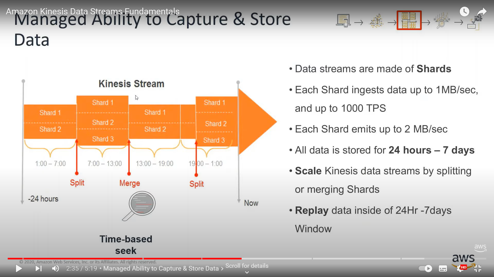
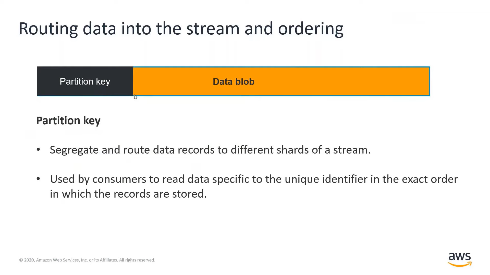
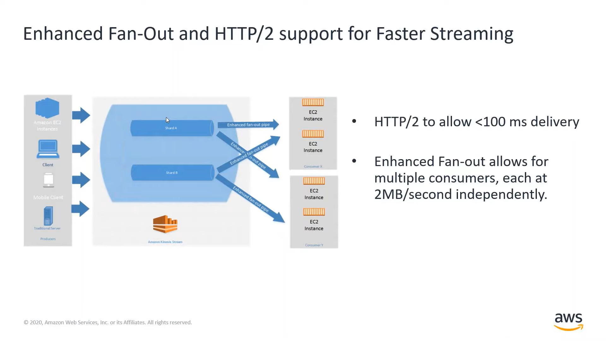

# Collection

## Ongoing collection

- If the data streams must be stored for _at least 3 days_, you must use Kinesis Data Streams which has a configurable data retention of between 1 and 365 days.
- The KPL has the mechanisms in place for retry and batching, as well as asynchronous mode. 
- The Kinesis agent is meant to retrieve server logs with just configuration files.
- Lambda can be a consumer for Kinesis Data Streams (KDS) but not for Kinesis Data Firehose (KDF). However, for transformation needs, Lambda can be used in conjunction with KDF.

### Kinesis Data Streams

- KDS with provisioned capacity does not scale as the load increases. 
- With on-demand scaling, KDS can be used for scaling with increasing data, but if the processing times are in minutes (not seconds), a different approach (such as SQS) could be required.
- For ongoing data collection and when configurable data retention is required, choose _Kinesis Data Streams_ over _Kinesis Data Firehose_.
- KDS can replay data to handle downstream failures.

> Kinesis Data Stream allows Data replays (in the same order). SQS _does not_ allow data replays_, and DynamoDB would allow to replay some data, but it’d be different to get some ordering constraints working as well as well as enable real time use cases.

### Kinesis Data Firehose

- Using KDF, data can be sinked into S3, Redshift, ElasticSearch or Splunk.

## Cost

- **KDS**: You pay per shard hour and per PUT payload unit. Optionally, there are fees associated with extended data retention and enhanced fan-out, if you choose to use those features. 
- **KDF**: You pay for the volume of data you ingest using the service and for any data format conversions.
- **DMS**: You pay for compute resources (depending on instance type) used during the migration process and any additional log storage. There are also potential data transfer fees.
- **Glue**: With AWS Glue, you pay an hourly rate, billed by the second, for crawlers (discovering data) and ETL jobs (processing and loading data).

## Delivery Guarantees

- Amazon SQS (FIFO) and Amazon DynamoDB streams provide **exactly-once** delivery. All other AWS services provide at-least-once.
- All services listed (i.e. KDS, DynamoDB Streams, Amazon MSK and SQS FIFO) support guaranteed delivery, except for Kinesis Data Firehose and Amazon SQS (Standard).

## Transform and filter data during collection process 

- Use Lambda to transform data that is in KPL or GZIP into JSON or CSV for Kinesis Data Analytics.
    - Data Enrichment
    - String Transformation
    - Data Filtering 
- Use KDF Transformation to batch, compress, and encrypt data before loading it.
- DMS can be used for schema conversions. 
    - It also supports Apache Parquet format when migrating data to Amazon S3.
