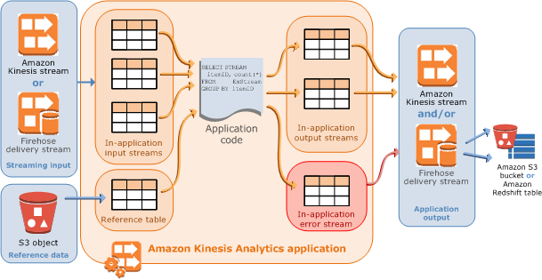

# Kinesis Data Analysis

## Integration with Kinesis Firehose
- Amazon Kinesis Data Analytics can query data in a Kinesis Data Firehose delivery stream in near-real time using SQL.
- A sliding window analysis is appropriate for determining trends in the stream.

## Kinesis Data Analytics Application

- You cannot configure either Amazon DynamoDB or AWS Glue Data Catalog as a reference data source for a Kinesis data analytics application.
- An Amazon Kinesis Data Analytics application can receive input from a single streaming source and, optionally, use one reference data source to enrich the data coming in from streaming sources. **You must store reference data as an object in your Amazon S3 bucket**.
- Suppose that you want to refresh the data after Kinesis Data Analytics creates the in-application reference table, you can explicitly call the UpdateApplication API.

