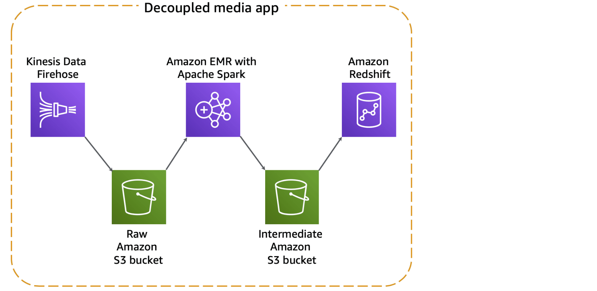

# Exam Preparation

## Domain Level Breakup

| Domain | Percentage |
| :---        |          ---: |
| Collection | 18% |
| Storage and Data Management | 22% |
| Processing | 24% |
| Analysis and Visualization | 18% |
| Security | 18% |

## Cognitive level of questions

>  Specialty-level exam questions are not designed to solely test your recall of an AWS service. Instead, they challenge you to apply your knowledge of AWS services, features, and related concepts to a given scenario.

## Strategies

1. _Read and Understand the question first_.
2. _Identify the key phrases and qualifiers_.
3. _Try to answer the question before even looking at the answer choices_.
4. _Eliminate answer options based on key phrases and qualifiers_.
5. _Flag & move on as required. But remember to answer all the questions).

## Collection

- Variety: Structured, Semi-Structured, and unstructured
- Speed: Batch to Streaming
- Choose a system based on 
    - Frequency
    - Volume
    - Source of Data
- **Decouple your data pipeline** to _make it easier to manage_, and _reduce cost_ (i.e. do not overprovision)
- **Failure handling** is especially important in the collection/ingestion phase, as losing large data sets can be difficult to recover.
- Understanding the Operational Characteristics:
    - Fault Tolerance and Data Peristence
        - KPL retries and rate limiting
        - Implementing efficient and reliable producers
    - Durability and Availability
        - KDS replicates data across 3 availability zones. Can retain data for 24 hours (by default)
        - KCL offers _checkpointing_ to handle KCL worker failures. However, can get throughput exception errors, if there are too many shards or if the application does frequent checkpointing.

