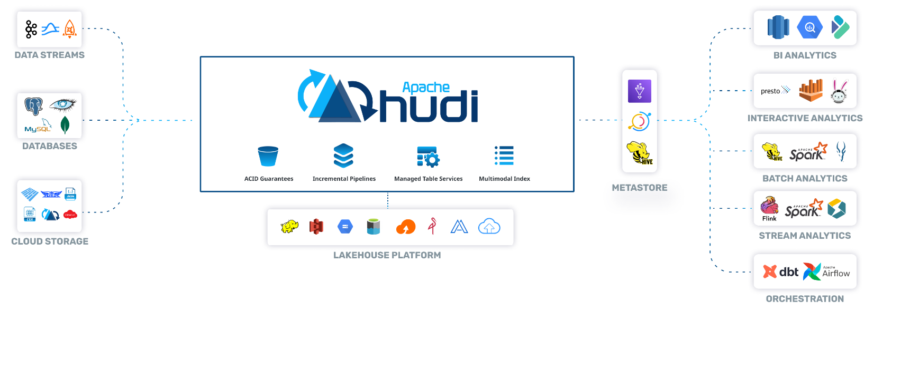

# Amazon EMR

Amazon EMR is highly scalable big data platform that supports open source tools such as _Apache Spark_, _Apache Hive_, _Apache HBase_, _Apache Flink_, _Apache Hudi (Incubating)_, and _Presto_.

## Apache Ranger on EMR

> Apache Ranger is a role-based access control framework to enable, monitor, and manage comprehensive data security across the Hadoop platform. 

### Key Characteristics

- Centralized security administration and auditing
- Fine-grained authorization across many Hadoop components (Hadoop, Hive, HBase, Storm, Knox, Solr, Kafka, and YARN)
- Syncs policies and users by using agents and plugins that run within the same process as the Hadoop component
- Supports row-level authentication and auditing capabilities with embedded search.

## Amazon EMR & Events

- You can now respond to Amazon EMR cluster state changes with Amazon CloudWatch Events. 
- The new Amazon EMR event types in Amazon CloudWatch Events provide information including state and related severity for Amazon EMR clusters, instance groups, steps, and Auto Scaling policies.

## EMRFS

- EMRFS uses an Amazon DynamoDB database to store object metadata and track consistency in Amazon S3
- EMRFS allows you to define retry rules for processing inconsistencies

> With the release of Amazon S3 strong read-after-write consistency on December 1, 2020, you no longer need to use EMRFS consistent view (EMRFS CV) with your Amazon EMR clusters.

## Notifications

Amazon EMR can only be configured as a publisher to an SNS topic—it cannot subscribe to notifications.

## High Availability

- Amazon EMR supports multiple master nodes to enable high availability for EMR applications. 
- Launch an EMR cluster with three master nodes and support high availability applications like YARN Resource Manager, HDFS Name Node, Spark, Hive, and Ganglia. 
- _EMR clusters with multiple master nodes are not tolerant of Availability Zone failures. In the case of an Availability Zone outage, you lose access to the EMR cluster._
- Using the Amazon EMR version 5.7.0 or later, you can set up a read-replica cluster, which allows you to maintain read-only copies of data in Amazon S3. In the event that the primary cluster becomes unavailable, you can access the data from the read-replica cluster to perform read operations simultaneously.

## Metastore

Using Amazon EMR version 5.8.0 or later, you can configure Hive to use the AWS Glue Data Catalog as its metastore. This configuration is recommended if the metastore is shared by different clusters.

## EMR Components

### Presto

- Presto is a fast SQL query engine designed for interactive analytic queries over large datasets from multiple sources. 
- It supports both non-relational sources, such as the Hadoop Distributed File System (HDFS), Amazon S3, and HBase, and relational data sources such as MySQL, PostgreSQL, and Amazon Redshift. 
- _Presto can query data where it’s stored, without needing to move data into a separate analytics system_. 
- _Query execution runs in parallel over a pure memory-based architecture, with most results returning in seconds_.

> You can launch a Presto on Amazon EMR cluster in minutes. You don’t need to worry about node provisioning, cluster setup, configuration, or cluster tuning. Amazon EMR takes care of these tasks so you can focus on analysis.

> If the use case is *Interactive Analytic queries over <u>large datasets</u> from <u>multiple sources</u>*, choose Presto on EMR.

### Spark

- Apache Spark is an open-source, distributed processing system used for big data workloads. 
- It utilizes in-memory caching, and optimized query execution for fast analytic queries against data of any size. 
- It provides development APIs in Java, Scala, Python and R, and supports code reuse across multiple workloads—batch processing, interactive queries, real-time analytics, machine learning, and graph processing.

#### Stream processing

- Consume and process real-time data from Amazon Kinesis, Apache Kafka, or other data streams with Spark Streaming on EMR. 
- Perform streaming analytics in a fault-tolerant way and write results to S3 or on-cluster HDFS.

> For a more efficient stream processing Flink could be a better fit than Spark (since Spark employs a micro-batch approach)

#### Interactive SQL

- Use Spark SQL for low-latency, interactive queries with SQL or HiveQL. 
- Spark on EMR can leverage EMRFS, so you can have ad hoc access to your datasets in S3. 
- Also, you can utilize EMR Studio, EMR Notebooks, Zeppelin notebooks, or BI tools via ODBC and JDBC connections.

### Hive 

Apache Hive is an open-source, distributed, fault-tolerant system that provides data warehouse-like query capabilities. It enables users to read, write, and manage petabytes of data using a SQL-like interface.

> **Hive vs HBase**: Apache HBase is a NoSQL distributed database that enables random, strictly consistent, real-time access to petabytes of data. Apache Hive is a distributed data warehouse system that provides SQL-like querying capabilities.

#### Ad-Hoc SQL Queries on S3

- Airbnb uses Amazon EMR to run Apache Hive on a S3 data lake. 
- Running Hive on the EMR clusters enables Airbnb analysts to perform ad hoc SQL queries on data stored in the S3 data lake. 
- By migrating to a S3 data lake, Airbnb reduced expenses, can now do cost attribution, and increased the speed of Apache Spark jobs by three times their original speed.

> Hive enables analysts to perform ad hoc SQL queries on data stored in the S3 data lake. This reduces operational costs.

> Using Amazon EMR version 5.8.0 or later, you can <u>configure Hive to use the AWS Glue Data Catalog as its metastore</u>. This configuration is recommended if the metastore is shared by different clusters.

> **Hive vs. Impala**: The main difference between Hive and Impala is that the Hive is a data warehouse software that can be used to access and manage large distributed datasets built on Hadoop while Impala is a massive parallel processing SQL engine for managing and analyzing data stored on Hadoop.

### HBase

- Apache HBase is an open-source, NoSQL, distributed big data store. 
- It enables random, strictly consistent, real-time access to petabytes of data. 
- HBase is very effective for handling large, sparse datasets.
- HBase integrates seamlessly with Apache Hadoop and the Hadoop ecosystem and runs on top of the Hadoop Distributed File System (HDFS) or Amazon S3 using Amazon Elastic MapReduce (EMR) file system, or EMRFS. 
- HBase serves as a direct input and output to the Apache MapReduce framework for Hadoop, and works with Apache Phoenix to enable SQL-like queries over HBase tables.

### Hudi

Hudi brings (a) transactions (b) change streams and (c) record-level updates/deletes to Data Lakes.

