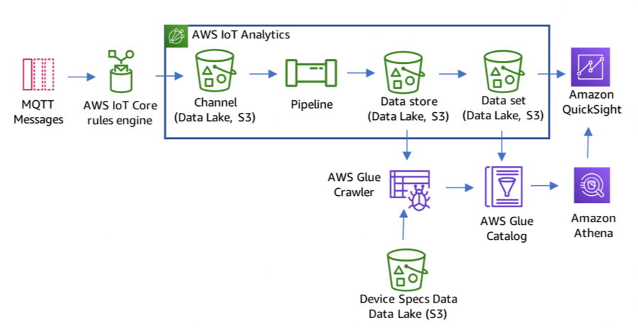

# AWS IOT

- AWS IoT provides the cloud services that connect your IoT devices to other devices and AWS cloud services. 
- AWS IoT provides device software that can help you integrate your IoT devices into AWS IoT-based solutions. 
- If your devices can connect to AWS IoT, AWS IoT can join them in the AWS cloud services.
- AWS IoT Analytics automates the steps required to analyze data from IoT devices. 
- AWS IoT Analytics filters, transforms, and enriches IoT data before storing it in a time-series data store for analysis.
- You can set up the service to collect only the data you need from your devices, apply mathematical transforms to process the data, and enrich the data with device-specific metadata such as device type and location before storing it.
- You can then analyze your data by running queries using the built-in SQL query engine or perform more complex analytics and machine learning inference.

