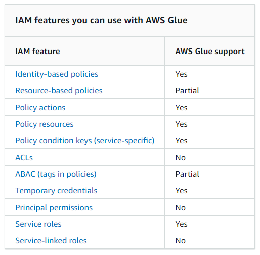
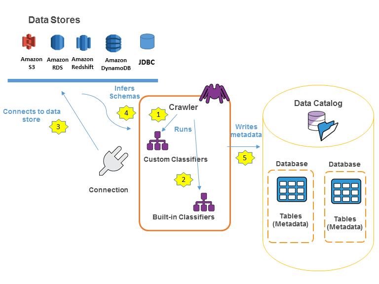
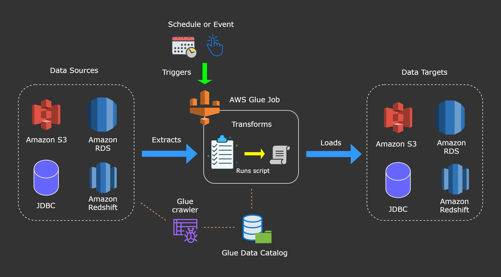

# Glue

## PySpark extensions

### Relationalize
- Converts a DynamicFrame into a form that fits within a relational database.
- Relationalizing a DynamicFrame is especially useful when you want to move data from a NoSQL environment like DynamoDB into a relational database like MySQL.
- [Example](https://docs.aws.amazon.com/glue/latest/dg/aws-glue-api-crawler-pyspark-extensions-dynamic-frame.html#pyspark-relationalize-example)

## Data Access & Security

- AWS Glue resource policies can be used to control access to Data Catalog resources.

## Glue Crawler

- AWS Glue can crawl data in different AWS Regions. 
- When you define an Amazon S3 data store to crawl, you can choose whether to crawl _a path in your account_ or _another account_ or _another region_.
- Use one or more of the following methods to reduce crawler run times.
    - Use an exclude pattern
    - Run multiple crawlers
    - Combine smaller files to create larger ones

## Glue Data Catalog

## Glue support

> AWS Glue job usually executes _Apache Spark_, _Spark Streaming_, or _Python shell scripts_ only. 

> AWS Glue doesn't directly support Apache Hive.